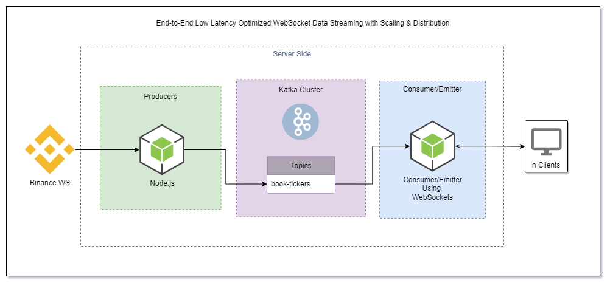

# Interview: End-to-End Low Latency Optimized Binance WebSocket High Frequency Book Ticker Streaming (with Scaling & Distribution for Millions of Simultaneous End-User Connections)

Here is the simplified architecture of what we are running at the moment:



It is an architecture for achieving super-low latency messaging while broadcasting WebSocket connections to millions of users. How would _you_ achieve this at scale?

We use Node.JS for the producer and the consumer, and we want to connect clients via WebSockets. We want you Fork this repo and dev this up locally with Docker, and containerise the microservices.

## 1. The Producer: Binance WebSockets

This Node.js server connects to the [Binance WebSocket API](https://binance-docs.github.io/apidocs/spot/en/#individual-symbol-book-ticker-streams) and provides real-time individual symbol book ticker streams.

This code establishes a connection to the Binance WebSocket API, retrieves a list of trading symbols, sets up a WebSocket connection for each chunk of symbols, and streams real-time data for the best bid and ask prices for each symbol. The data is then parsed and transformed, ready to be sent to our message broker; Kafka. We also add the producerTime key to the message object so we can time the latency of the architecture later on.

Here is a snippet to get you started:

```JavaScript
var request = require("request-promise");
var WebSocketBinance = require("ws");
const config = require("./config");
const url = config.exchanges.url;

async function app() {
  //-----------     Prices WebSocket   -------------
  await request(url, function (error, response, body) {
    if (!error && response.statusCode === 200) {
      var data = JSON.parse(body);

        ...
        //-----------     Prices WebSocket   -------------
        var wsPrices = new WebSocketBinance(
          config.exchanges.bookTickerStream.concat(bookTickerString)
        );

        wsPrices.on("open", function open() {
          console.log(
            "Connected to Binance Streams - bookTicker stream #chunk_" + i
          );
        });

        wsPrices.on("message", function incoming(data) {
          const send = async function (bt) {
            try {
              var bookTicker = JSON.parse(bt);

              //define message
              const message = {
                key: bookTicker.data.s,
                value: JSON.stringify({
                  bid: bookTicker.data.b,
                  bids: bookTicker.data.B,
                  ask: bookTicker.data.a,
                  asks: bookTicker.data.A,
                }),
              };

              // if the message is written successfully, log it (or send to Kafka?!?)
              console.log(JSON.stringify(message));
            } catch (err) {
              await pricesProducer.disconnect();
              console.log("disconnected");
              console.error("could not write message: " + err);
            }
          };

          send(data);
        });

        wsPrices.on("close", function closedConnection() {
          console.log("Connection closed by Binance");
        });

        wsPrices.on("error", function (error) {
          console.error("WebSocket error: ".concat(error));
        });
      }
    }
  };
```

This should give you access to the individual symbol book ticker streams from binance!

## 2. Kafka Cluster

To set up the Kafka broker we simply follow the [Apache Kafka® Quick Start](https://developer.confluent.io/quickstart/kafka-docker/) by Confluent. The Docker Compose file will run everything we need via Docker. From a directory containing the docker-compose.yml file, we run `docker-compose up -d`. Kafka stores messages in topics, so tt’s good practice to explicitly create them before using them, even if Kafka is configured to automatically create them when referenced. To do this, we run:

```bash
docker exec broker kafka-topics --bootstrap-server broker:9092 --create --topic book-tickers
```

For dev, it is also useful to log the messages written to the topic:

```bash
docker exec --interactive --tty broker kafka-console-consumer --bootstrap-server broker:9092 --topic book-tickers
```

Another option here would have been to use something like Offset Explorer, a UI for Kafka.

I've provided this for you in the Kafka folder.

## 3. Consumer/Emitter

The most challenging aspect of this architecture is the last-mile integration with millions of devices. Although Kafka provides a scalable, fault-tolerant backbone for event-like data to be written to and read from, it does not support the WebSocket protocol. Additionally, simply adding support for the WebSocket protocol in Kafka would not scale. A 1:1 mapping between consumers and Kafka topics is simply not scalable and Kafka is not optimized to fan-out messages to a high number of clients over the Internet (Kafka _was_ Kafka designed chiefly for machine-to-machine communication inside a network). How would you address this issue?

## Summary & Stretch Goals

We want you Fork this repo and dev this up locally with Docker, and containerise the microservices.

Stretch:

- You mentioned using ECS on your CV. _Describe_ briefly the architecture you would use in deployment to scale this in AWS.
- How would you optomise this stack for low latency?

## Links & Resources

- [kafka-node](https://www.npmjs.com/package/kafka-node)
- [kafkajs](https://www.npmjs.com/package/kafkajs)
- [Real-Time Gaming Infrastructure for Millions of Users with Apache Kafka, ksqlDB, and WebSockets](https://www.confluent.io/en-gb/blog/real-time-gaming-infrastructure-kafka-ksqldb-websockets/)
